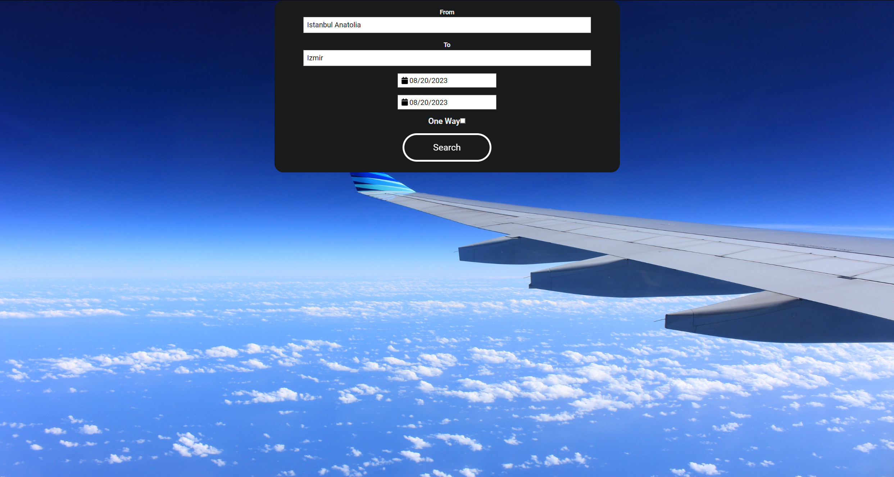
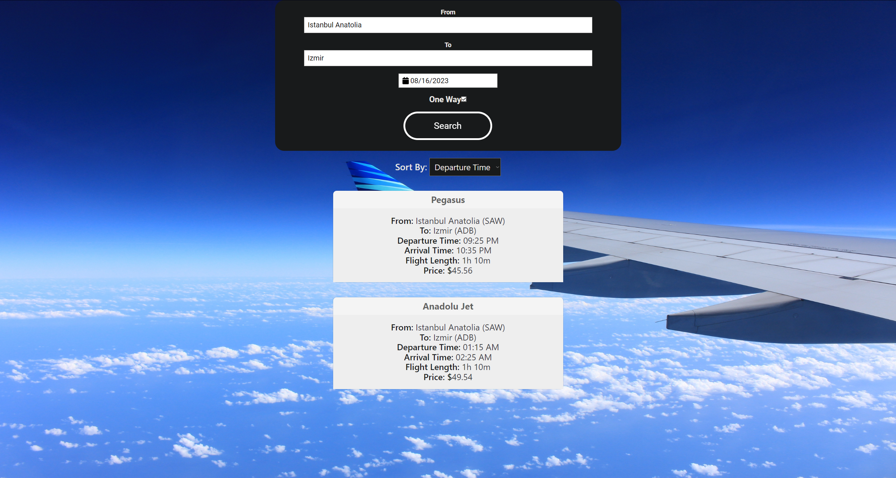
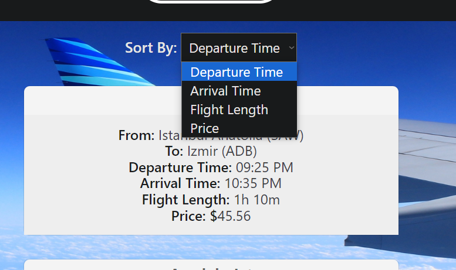

# Flight Search App

This is a flight search application built using React. It allows users to search for flights based on departure and arrival cities, departure date, and optional return date.

## Features

- **Search Form:** Users can enter departure and arrival cities, select departure and return dates, and choose whether the flight is one way or round trip.

- **Flight List:** Displays a list of available flights based on the user's search criteria. Flights are sorted by various filters such as departure time, arrival time, flight length, and price.

- **Flight Card:** Displays detailed information about a specific flight, including airline, departure and arrival cities, departure and arrival times, flight length, and price.

## Screenshots

## Installation and Usage

1. Clone the repository: `https://github.com/BusraKahraman/Flight-Search-Application`

2. Navigate to the project directory: `cd flight-search-app`

3. Install dependencies: `npm install`

4. Start the development server: `npm start`

5. Open your web browser and go to `http://localhost:3000` to use the application.
